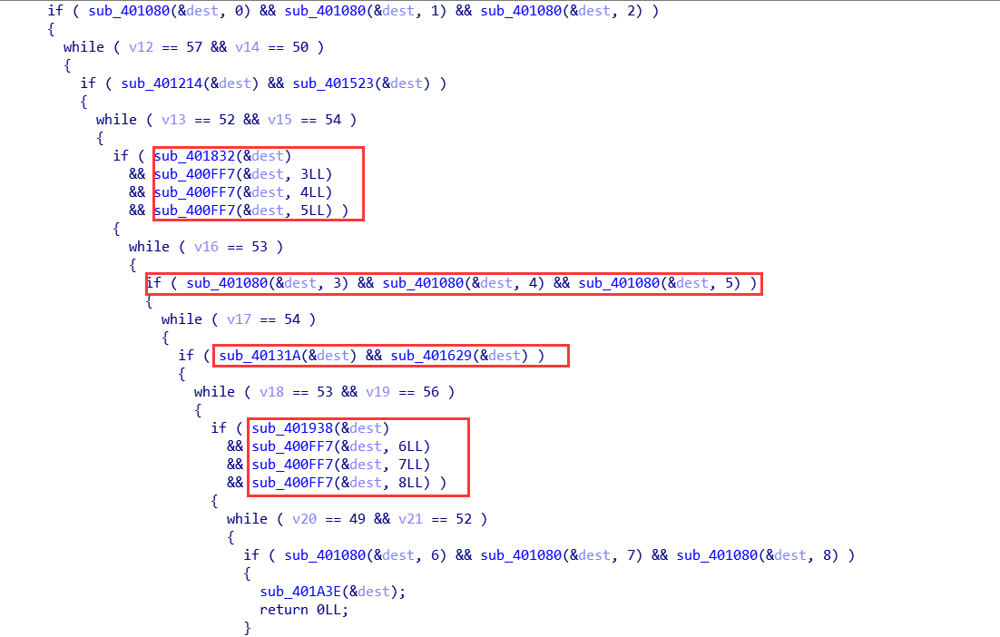

## fungame writeup
这道题目先在IDA里面分析一下，发现是用命令行参数去校验的，然后命令行参数经过了一系列检查，检查函数有好多个，如下图:

但是经过分析发现上图中的函数都是在确定命令行参数中的其中9个元素经过一种变换之后的和是否为45，实际上这个 x=(x & 0xF) 的变换和 x=(x - 48) 等价，可以联想到这是一个数独游戏的实现，函数是数独规则的校验，直接数值的检查是数独的初始值，由此填出剩余的数字即可，在数独游戏完成后会进入sub_401A3E()函数中，这个函数实际上是取命令行参数的8个元素作为密钥解密flag的函数，执行到这可以直接出flag。

输入的命令行参数为：198657432273184956456923718985432671324716895617598324761345289532869147849271563
然后得到flag为：
JNCTF{c6fbba5a091edd51febde54e936743e5d}

