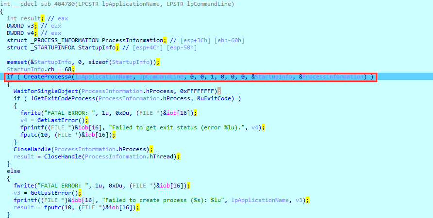

## Helloruby Writeup
给的是一个exe程序，运行就是一个命令行程序，输入flag校验，在OD里面F9会直接报错，这个时候如果你注意到报错信息的话可以注意到程序想创建一个ruby的进程，如果你去这个目录下找的话可以找到ruby.rb，如果没发现的话就去单步跟踪这个程序，这里用IDA在伪C代码下去跟踪比较快一点，通过不断测试程序中断让用户输入的地方可以发现有一个进程创建的函数在sub_404780函数下，如图所示：

根据这个CreateProcessA函数的参数可以确定这个函数的目的时创建一个ruby.exe去执行一个helloruby.rb的代码，这个rb文件是程序运行的程序，rb文件如下:
```ruby
require 'openssl'
require 'base64'

def aes_encrypt(key,encrypted_string)
	aes = OpenSSL::Cipher.new("AES-128-ECB")
	aes.encrypt
	aes.key = key
	cipher = aes.update(encrypted_string) << aes.final
	return Base64.encode64(cipher)
end

print "Show me Your flag:"
flag = gets.chomp

key = "Welcome_To_JNCTF"
cipher = "q6gng2lEJA60aPtwtUSbSc4WAzUtTDIeXrXqaJCyfIQ=\n"

text = aes_encrypt(key,flag)

if cipher == text
	puts "you got it!"
else
	puts "try again!"
end
```
看出是一个ECB的AES加密，密钥密文都有，解密一下即可得到flag
JNCTF{ruby_is_not_so_boring}